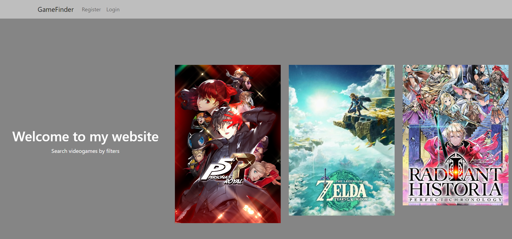
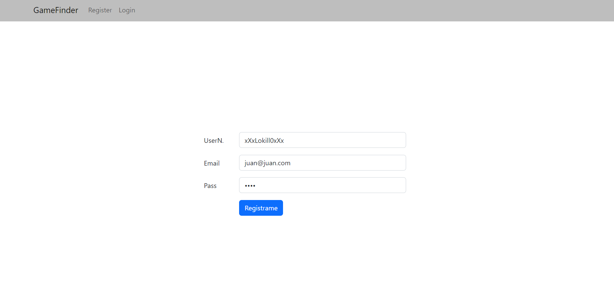
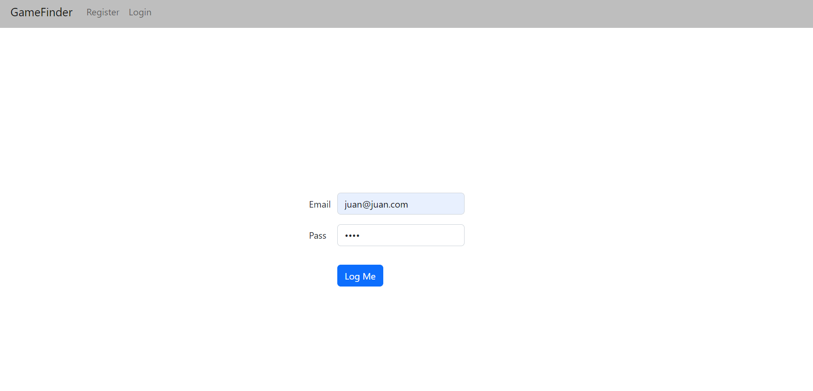
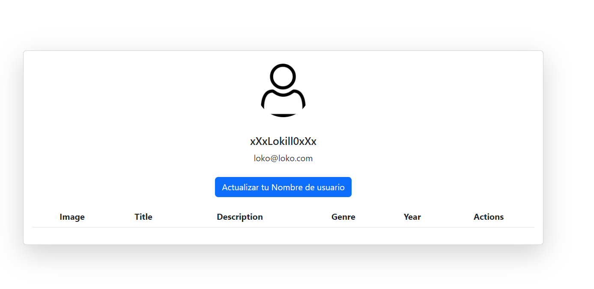
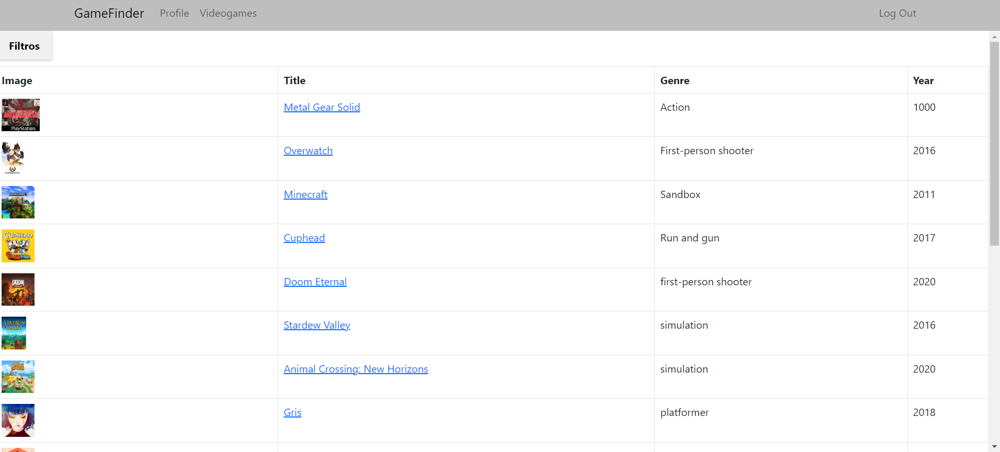
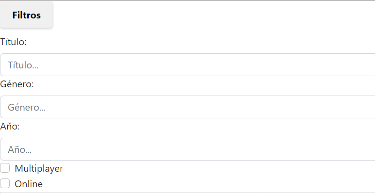
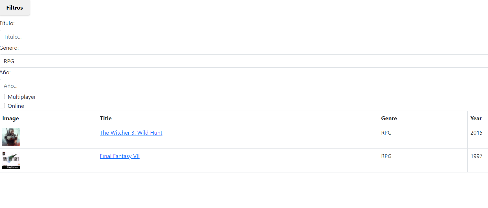
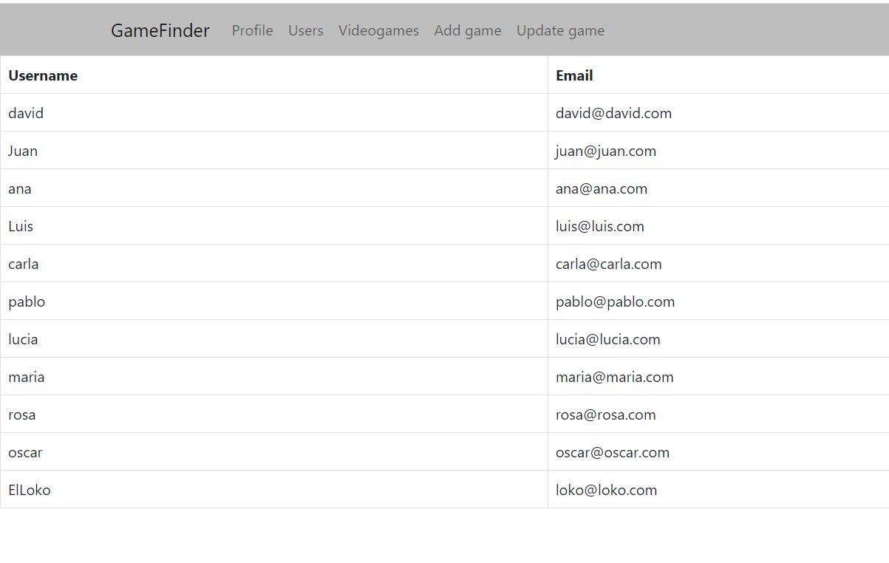

# Videogame Finder

  
Contenido 📝

  <ol>
    <li><a href="#sobre-el-proyecto">Sobre el proyecto</a></li>
    <li><a href="#stack">Stack</a></li>
    <li><a href="#capturas-del-proyecto">Capturas</a></li>
    <li><a href="#agradecimientos">Agradecimientos</a></li>
  </ol>

## Sobre el proyecto
---

Este es el proyecto final del bootcamp fullstack developer en Valencia, realizado por David Valero. Este proyecto es la parte frontend del backend realizado anteriormente. 

Como usuarios podremos: 
<ol>
<li>Registrarnos</li>
<li>Buscar todos los videojuegos</li>
<li>Buscar por filtros</li>
<li>Vista detalle del videojuego</li>
<li>Añadir videojuegos a favoritos</li>
<li>Eliminar videojuegos de favoritos</li>
<li>Ver nuestro perfil</li>
<li>Modificar el nombre de usuario desde nuestro perfil</li>
<li>Ver la tabla de videojuegos añadidos a favoritos desde nuestro perfil</li>

</ol>

Como Administrador podremos:
<ol>
<li>Realizar todo lo anterior mencionado</li>
<li>Añadir videojuegos a la base de datos desde el front</li>
<li>Actualizar videojuegos a la base de datos desde el front</li>
</ol>

---

## Stack
Tecnologías utilizadas:

</a>

 

 
 ---

## Capturas del proyecto

Capturas

En primer lugar teneis una vista Home minimalista sin muchos elementos en la pantalla ya que en la vista principal de una web en lo personal no me gusta que sea cargante para la vista, tan solo lo justo y necesario. En la parte superior tenemos el navbar donde de primeras podremos registrarnos o bien realizar login si ya estamos registrados.

Aquí teneis una captura del formulario de registro:

Este sería el formulario de login:

Una vez registrados podremos apreciar que los componentes del navbar cambian pasando a mostrarnos las opciones de "profile", "videogames" y "logout"

Si entramos en la vista "profile" podremos encontrar una card con nuestro nombre de usuario, email y justo debajo una tabla donde se iran mostrando los videojuegos añadidos a favoritos.

Desde la misma vista "profile" podremos actualizar nuestro nombre de usuario pulsando en "actualizar tu nombre de usuario".

Como usuario si accedemos a la vista "videogames" tendremos una tabla donde apareceran todos los videojuegos de la base de datos.

En la parte superior de la vista "videogames" tendremos un desplegable donde se encuentran los filtros.

Si queremos filtrar tan solo tendremos que rellenar cualquiera de los campos con lo que deseamos filtrar.

Si pulsamos en el nombre de cualquier videojuego mostraremos una vista detalle de dicho videojuego.

Desde la misma vista detalle tendremos la opción de agregar dicho videojuego a favoritos y poder verlo despues en nuestro perfil.

Una vez añadido el videojuego a favoritos si volvemos a la vista profile podremos ver al final de la página los videojuegos añadidos a favoritos con la opción de eliminarlos de favoritos si así se desea.

Si nos logeamos como administrador la navbar volverá a cambiar añadiendo las pestañas "users", "add videogame" y "update videogame".

En la vista "users" podremos ver todos los usuarios registrados.

En la vista "add videogame" podremos añadir videojuegos a la base desde el front pasandole todos los campos.

Y por ultimo en la vista "update videogame" podremos actualizar un videojuego ya existente en la base de datos desde el front.

--- 

## Agradecimientos

Me gustaria agradecer como es de costumbre a uno de mis mejores amigos, **Adrian Nuñez**. Siempre ha estado dispuesto a ayudarme pese a ser una persona muy ocupada, he aprendido mucho gracias a el y le debo muchisimo.

Tambien a mis compañeros de Bootcamp los cuales me han ayudado/aconsejado y animado, en especial a **Alvaro** quien no dudó en conectarse conmigo por la noche para ayudarme con problemas varios. 
